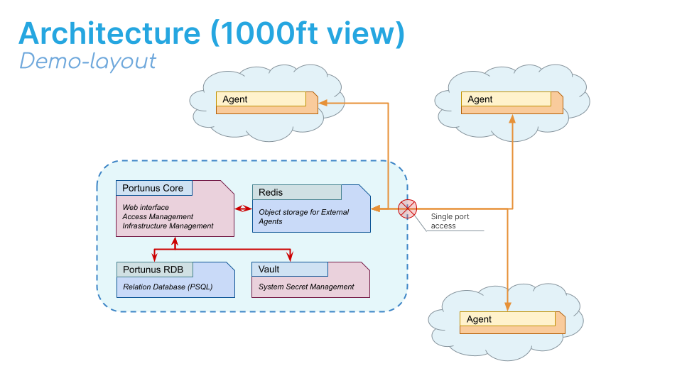

Installation Guide
===============================

Portunus is basically composed of a core platform and several remote agents as illustrated below.

Portunus can be deployed on premise, in the cloud, or mixtures of both.
It is possible to use a managed cloud deployment of Portunus with Agents deployed on premise.

.. Reference: https://chiplicity.readthedocs.io/en/latest/Using_Sphinx/UsingGraphicsAndDiagramsInSphinx.html

.. graphviz::

   digraph {
      "Portunus" -> "Agent Bus";
      "Agent Bus" -> "Agent A";
      "Agent Bus" -> "Agent B";
      "Agent A" -> "Server 10.0.0.1";
      "Agent A" -> "Server 10.0.0.2";
      "Agent A" -> "Server 10.0.0.3";
      "Agent B" -> "Server 10.0.0.4";
      "Agent B" -> "Server 10.0.0.5";
   }

Remote Agents interact with external hosts (e.g. Unix servers via SSH, or SQL Database via client).
They would collect data and return that to Portunus.

Demo Architecture
-----------------

An overview of the architecture used in this demo is given below.
The endpoints (or AccessHosts) reachable from each Agent are not shown here.

.. toctree::
    :glob:
    :maxdepth: 2
    :caption: Installation scenarios:

    install_guide/*
