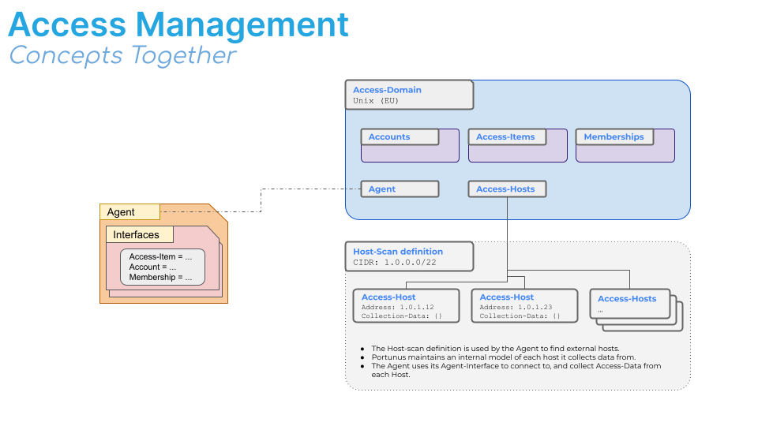

User Guide
================

The following sections explore core features of Portunus from multiple perspectives - including Administrators, Managers, and Users.

Terms used in the documentation below can be referenced against terminology here :ref:`technical-details`

Explore the child-pages below - as this documentation matures, an overview will be provided to help guide a new reader through these with better context.

Below is an illustration to help show how some of the concepts in Portunus come together with regards to how Access is Managed.

.. toctree::
    :glob:
    :maxdepth: 2
    :caption: User Guide Pages:

    user_guide/*
